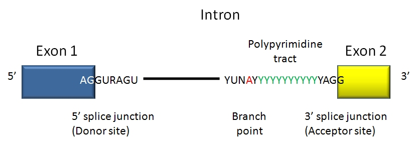

<style>
a:link {
    color: red;
}

a:visited {
    color: green;
}

a:hover {
    color: hotpink;
}
p.caption {
  font-size: 0.8em;
}

</style>

***

```{r setup, include=FALSE}
knitr::opts_chunk$set(
  echo = TRUE,
  warning = FALSE,
  message = FALSE,
  fig.width = 8,
  fig.height = 6
)
```

<br>


# Introduction

---

Gene annotations are provided by several databases that integrate data from systematic explorations of various experimental and computational resources. The **GENCODE** project [1], part of the ENCODE project [2], offers accurate annotations of the human and mouse genomes derived from literature, primary data repositories, computational predictions, manual annotation, and experimental validation of genes and transcripts, including noncoding transcripts that are continually discovered and annotated. GENCODE is one of the most comprehensive and standardized databases for gene annotations, widely used by the scientific community.​

The gene sets provided by GENCODE are comprehensive and include protein-coding and non-coding loci, encompassing alternatively spliced isoforms and pseudogenes. GENCODE gene annotations are regularly updated and released as the Ensembl/GENCODE gene sets, accessible via the official website (https://www.gencodegenes.org). As of October 2024, the latest human release is GENCODE 47, and the latest mouse release is GENCODE M36 [1]. GENCODE gene sets are released approximately four times a year for mouse and twice a year for human [1].​

**GencoDymo2** is an R package designed to interrogate different releases of GENCODE annotations from the human and mouse genomes. It provides a streamlined interface for accessing and processing GENCODE annotations, providing easily accessible data regarding annotation statistics, release comparisons, and information on introns and splice sites. Moreover, GencoDymo2 can produce FASTA files of donor and acceptor splice site motifs that can be directly uploaded to the MaxEntScan tool [3] for the calculation of splice site scores.

<br>

GencoDymo2 can be used to import and process any gtf/gff3 formatted file. It automatizes and speeds up the following data manipulation steps:   

 * Dynamic detection of latest GENCODE releases from the official website
 * Unified interface for GTF/GFF3 file retrieval for the human and mouse genomes
 * Compare annotations from different GENCODE releases
 * Perform summary statistics on gene annotations
 * Extract introns information
 * Assign splice sites consensus sequence
 * Compile MaxEntScan splice sites motifs

***
<br>

# Installation

---

GenocDymo2 runs in the R statistical computing environment. You will need R version 4.1.0 or higher. The most recent version of GencoDymo2 can be installed from GitHub (keep dependencies=TRUE)

```{r install, eval=FALSE}
# Install from GitHub
if (!require("devtools")) install.packages("devtools")
devtools::install_github("monahton/GencoDymo2", dependencies = TRUE)

library(GencoDymo2)
```

***
<br>

# Data Retrievel

---

## Release Management

GENCODE releases annotations approximately every three months, coinciding with Ensembl releases. The latest release from GENCODE for human and mouse genomes can be obtained using the <span style="color:coral">`get_latest_release()`</span> function.


### Basic Usage
```{r get_release, eval=FALSE}
# Get latest human release
human_release <- get_latest_release("human", verbose = TRUE)
```
```{r get_release_ex, echo=FALSE}
# Get latest human release
cat("Latest human GENCODE release: release_47") 
```

<br>

## File Retrieval

GencoDymo2 allows the download of `gtf` and `gff3` files of the latest release or any release specified by the user. These files can be obtained for human and mouse genome and can be saved in a path specified by the user.

### Standard Workflow
```{r get-files, eval=FALSE}
# Download latest human lncRNAs GTF
lnc_47_gtf <- get_gtf(
  species = "human",
  release_version = "latest_release",
  annotation_type = "long_noncoding_RNAs.gtf.gz",
  dest_folder = "annotations"
)

# Download specific mouse GFF3
lnc_47_gff3 <- get_gff3(
  species = "mouse",
  release_version = "release_M28",
  annotation_type = "primary_assembly.annotation.gff3.gz"
)
```

### Supported Annotation Types

The valid annotation types for both the gtf and gff3 format can be one of the following:
```{r annotation-types, echo=FALSE}
cat("Valid Annotation Types:\n")
valid_annotation_types <- c(
    "annotation",
    "basic.annotation",
    "chr_patch_hapl_scaff.annotation",
    "chr_patch_hapl_scaff.basic.annotation",
    "long_noncoding_RNAs",
    "primary_assembly.annotation",
    "primary_assembly.basic.annotation",
    "tRNAs",
    "polyAs")
valid_annotation_types

```

<br>

## Data Import

A `gtf` or `gff3` file can be imported to R as a dataframe using the <span style="color:coral">`load_file()`</span> function

### Basic Usage
```{r load-data, eval=FALSE}
# Import downloaded file
lnc_47_df <- load_file(lnc_47_gtf)
head(annotation_df)
```


***
<br>

# Introns Annotations

---

## Extract introns coordinates

<br>

The gtf files provided by GENCODE (for example the lncRNAs annotations gtf file) contains data regarding genes, transcripts, and exons only. Given the loaded data frame from the gtf files of GENCODE, the <span style="color:coral">`extract_introns()`</span> function produces a dataframe containing all the intronic regions in between all of those exons.


```{r introns, eval=FALSE}
# Extract introns from the gtf file of lncRNAs
introns_lnc_47 <- extract_introns(lnc_47_df)
 
```

<br>

The obtained data frame includes the introns coordinates, their corresponding gene and transcripts ids, and the ordinal position of the intron.

<br>

# Splicing Analysis

---

## Extract the donor and acceptor splice sites

<br>

Introns always have two distinct nucleotides at either end. At the 5' end, the splice donor site includes an almost invariant sequence GT (GU in the RNA). The splice acceptor site at the 3' end of the intron terminates the intron with an almost invariant AG sequence.

<br>



<br>

The majority of introns belong to the U2-type spliceosome and are flanked by GT–
AG splice site dinucleotides. The most frequent exception to this rule are the U2-type GC–AG splice sites, comprising ∼0.8% of human splice sites and about ∼0.09% of the human splice sites belong to the U12-type which are processed by the minor spliceosome
and are flanked by AT–AC dinucleotides [4].

<br>

The <span style="color:coral">`assign_splice_sites()`</span> function adds two new columns to the introns data frame, assigning both the 5' and 3' splice sites. The sequences are retrieved from a loaded BSgenome object such as `BSgenome.Hsapiens.UCSC.hg38` for human and `BSgenome.Mmusculus.UCSC.mm10` for mouse 

The first argument of the function is a dataframe containing intronic coordinates and a second argument should specify the genome sequence of the studied species (the human genome sequence hg38 is used by default). 

```{r splice-sites, eval=FALSE}
lnc_47_ss <- assign_ss(introns_lnc_47, 
                       genome = BSgenome.Hsapiens.UCSC.hg38, 
                       verbose = TRUE)
```

<br>

## Extract splice sites motifs for MaxEntScan webtool

<br>

**MaxEntScan** is a webtool based on the approach for modeling the sequences of short sequence motifs involved in RNA splicing which simultaneously accounts for non-adjacent as well as adjacent dependencies between positions. This method is based on the _'Maximum Entropy Principle'_ and generalizes most previous probabilistic models of sequence motifs such as weight matrix models and inhomogeneous Markov models [3]. \
The **MaxEntScan::score5ss** assign scores for donor splice sites according to four models (http://hollywood.mit.edu/burgelab/maxent/Xmaxentscan_scoreseq.html) by using **9-mer SEQUENCES** motif as input in a `.fa file`. The 9-mers motif contain 3 bases in the exon and 6 bases in the intron. \
The **MaxEntScan::score3ss** assign scores for donor splice sites according to three models (http://hollywood.mit.edu/burgelab/maxent/Xmaxentscan_scoreseq_acc.html). It takes as input a `.fa file` of **23-mer SEQUENCES** in which 20 bases are in the intron and 3 bases in the exon.

<br>

The <span style="color:coral">`extract_ss_motif()`</span> function is used along with BSgenome object of the studied species to retrieve _MaxEntScan::score5ss_ and _MaxEntScan::score3ss_ motif sequences. \
The user can choose to generate a **fasta file** in the working directory or any specified path as an output, that contains either 9-mers or 23-mers, respectively for each 5' and 3' splice-sites. It generates also a **dataframe** for the coordinates and IDs of the corresponding motifs. \
The generated fasta files can then be directly utilized by _MaxEntScan_ tools.

<br>

The first argument `input` is a dataframe containing the intron coordinates. The second argument `genome` is a BSgenome object (the human genome sequence hg38 is used by default). The third argument `type` specifies whether to extract motifs at the 5ss or the 3ss. Users can optionally set the argument `save_fasta` to TRUE to and the `output_file` argument to save a fasta file.


```{r motifs, eval=FALSE}
# Produce a fasta file with 5'ss 9-mers:
motifs_donor <- extract_ss_motif(input = introns_lnc_47,
                                 genome = BSgenome.Hsapiens.UCSC.hg38,
                                 type = "5ss",
                                 verbose = TRUE,
                                 save_fasta = TRUE,
                                 output_file = "5ss_motifs.fa")
# Produce a fasta file with 3'ss 23-mers:
motifs_acc <- extract_ss_motif(input = introns_lnc_47,
                               genome = BSgenome.Hsapiens.UCSC.hg38,
                               type = "3ss",
                               verbose = TRUE,
                               save_fasta = TRUE,
                               output_file = "3ss_motifs.fa")
```

<br>

## Extract unspliced transcripts or genes

<br>

Some genes are unspliced: composed by one single exon and have no introns.   
The <span style="color:coral">`extract_single_exon()`</span> function can extract all the **_single-exon_** genes or transcripts and returns in a dataframe with their ensembl gene IDs or transcript IDs.

```{r unspliced, eval=FALSE}
## identify single exon genes and transcripts
single_exon_genes <- extract_single_exon(lnc_47, level = "gene")
single_exon_trans <- extract_single_exon(lnc_47, level = "transcript")
```

<br>

## Extract cryptic splice sites

<br>

Cryptic splice sites are those that do not match the canonical donor (GT) or acceptor motifs (AG). The <span style="color:coral">`find_cryptic_splice_sites()`</span> function identifies potential cryptic splice sites by comparing sequence motifs in introns to canonical splice site motifs (donor and acceptor) that can be also specified by the user. It compares the identified splice sites with the provided canonical motifs and flags the sites that differ from the canonical patterns, making it useful for studying aberrant splicing events.

```{r cryptic, eval=FALSE}
## cryptic splice sites
cryp_ss <- find_cryptic_splice_sites(lnc_47_ss,
                                     genome = BSgenome.Hsapiens.UCSC.hg38,
                                     canonical_donor = "GT",
                                     canonical_acceptor = "AG")
```

<br>

***
<br>

# Utilities

---

## Assign the ordinal position of exons

<br>

The <span style="color:coral">`classify_exons()`</span> function adds a new column to the dataframe `(EXON_CLASSIFICATION)`, describing the position of each exon. Four categories are automatically generated: _(first_exons)_, _(inner_exons)_, _(last_exons)_ and _(single_exons)_. This classification is informative and useful for subsequent analysis, considering that first and last exons often have peculiar regulative roles.  


```{r exon-position, eval=FALSE}
# Annotate each exons as first, inner, last or single exons.
  classified_exons <- classify_exons(lnc_47)
```

<br>


## Redundant exons and introns

<br>

The <span style="color:coral">`eliminate_redundant_elements()`</span> function is used to retain unique exons or introns removing all redundant ones.
In fact, in genes with multiple transcripts, some exons are not alternatively spliced and will be represented in multiple transcripts. They share the same coordinates and Gene ID within the gtf file but different transcript and exon IDs. This function takes an exon/intron-containing dataframe as input and returns a data frame with unique exons only.

<br>

```{r redundant, eval=FALSE}
## redundant elements
nonredundant_exons <- eliminate_redundant_elements(classified_exons, element_type = "exon")
nonredundant_introns <- eliminate_redundant_elements(introns_lnc_47, element_type = "intron")
```

<br>

## Summary statistics 

---

GencoDymo2 provide a number of functions that gives a brief summary of data annotations in a particular GENCODE release regarding genes, transcripts, exons and introns of lncRNAs and protein-coding genes. Moreover, the package can compare different releases of GENCODE showing the variation in the number of annotations between them

<br>

## Compare annotations from GENCODE different releases

<br>

As GENCODE regularly updates its annotations, different releases from GENCODE contain differing number of annotations. Some genes are added in new releases while others are classified into different gene classes. In the majority of cases, the ensembl gene ID of genes remains constant while the gene name might vary. 

The <span style="color:coral">`gencode_compare()`</span> function compares two different releases of GENCODE annotations. \
The function takes three arguments: the _first release data frame_, _the newer release data frame_, and the _type_. The type represent the genetic element to be compared which can be _"gene"_, _"transcript"_, _"exon"_ or _"intron"_.

<br>


Let's load first in addition to the gtf file of lncRNAs annotations from release 32 _(gen32_lncRNA)_, the gtf file of release 30.

<br>

```{r eval=FALSE}
# download gtf file of lncRNA annotations from release 30
  download.file(url="ftp://ftp.ebi.ac.uk/pub/databases/gencode/Gencode_human/release_30/gencode.v30.long_noncoding_RNAs.gtf.gz", destfile = "gencode.v30.long_noncoding_RNAs.gtf.gz", method = "wget")

# load the downloaded gtf file as a data frame in r
  gen30_lncRNA <- load_gtf("gencode.v30.long_noncoding_RNAs.gtf.gz")
  gen30_lncRNA_introns <- extract_introns(gen30_lncRNA)
```

<br>

Now let's compare the different number of genes, transcripts, exons and introns between these two releases:

<br>

```{r eval=FALSE}
# Calculates the number of differing genetic elements
  gencode_compare(gen30_lncRNA, gen32_lncRNA, type = "gene")
  gencode_compare(gen30_lncRNA, gen32_lncRNA, type = "transcript")
  gencode_compare(gen30_lncRNA, gen32_lncRNA, type = "exon")
  gencode_compare(gen30_lncRNA_introns, gen32_lncRNA_introns, type = "intron")
```

<br>

The function produces as an outout a _**Delta**_ value, that corresponds to the difference in number between the specified elements of the two inputs, in addition to its **_Percentage_**.

<br>

The output is summarised in Table1.

<br>

Table 1. Number and percentage of the different genetic elements between release 30 and release 32 of GENCODE for lncRNAs.

Genetic Element | Release 30  | Release 32 | Delta | Percentage (%)
---- | -----  | ---- | ---- | ----
Genes | 16193 | 17910 | 1717 | 9.58
Transcripts | 30369 | 48351 | 17982 | 37.19
Exons | 96215 | 176413 | 80198 | 45.46
Introns | 65846 | 128062 | 62216 | 48.58


<br>


## Number of transcripts per gene

<br>

The <span style="color:coral">`genes_freq()`</span> function is used to produce a **Transcripts per Gene frequency table**. This table describes the number and the percentage of genes for which a given number of transcript isoforms exist.

<br>

```{r eval=FALSE}
# Transcripts per Gene frequency table:
  genes_freq_df <- genes_freq(gen32_lncRNA)

```

<br>

The output is a data frame composed of the following columns:

* The first column represents the number of transcript isoforms per gene.   
* The second column describes how many genes correspond to such isoforms number.   
* The third column reports the percentage of such elements.   

<br>

## Number of exons per transcript

<br>

The <span style="color:coral">`trans_freq()`</span> function is used to produce an **Exons per Transcript frequency table**. This table describes the number and the percentage of transcripts that are composed by a certain number of exons.

<br>

```{r eval=FALSE}
# Exons per transcript frequency table:
  trans_freq_df <- trans_freq(gen32_lncRNA)

```

 <br>

The output is a data frame composed of the following columns:

* The first column represents the number of exons per transcript.     
* The second column describes how many transcripts contain the specified number of exons.      
* The third column reports the percentage of such elements.   

<br>

## Spliced transcripts length

<br>

The <span style="color:coral">`spliced_trans_length()`</span> function calculates the length of each transcript in its mature form (following the splicing of its introns).

<br>

```{r eval=FALSE}
# Length of spliced transcript  
  spliced_trans_length(gen32_lncRNA)
```

<br>

## Exons length summary statistics

<br>

The <span style="color:coral">`stat_exon()`</span> function produces a data frame describing the _mean_, _median_, _standard deviation_ and _std error_ of exons' length. \
The function describes these parameters for exons taking into consideration their ordinal position.

<br>

```{r eval=FALSE}
# Calculates mean, median, sd and std error of exons
  stat_exon(gen32_lncRNA)
```

<br>

The output is generated for _single exons_, _first exons_, _inner exons_, and _last exons_. Length is reported in base pairs (bp). 


## Introns Statistics

<br>

The <span style="color:coral">`stat_intron()`</span> function produces a data frame describing the _mean_, _median_, _standard deviation_ and _std error_ of introns' length. \
The function describes the length of introns taking into consideration also whether they are first or inner, and from each category whether it harbors _GT-AG_, _GC-AG_ or _AT-AC_ splice sites. This classification could be of particular relevance as introns haroboring different splice sites have different length characteristics as reported in [5].

<br>

```{r eval=FALSE}
# Calculates mean, median, sd and std error of introns
stat_intron(introns_ss)
```

<br>

Length is reported in base pairs (bp).

***
<br>

# Session information

---

The following provides the session information used when compiling this document.

```{r eval=TRUE}
   devtools::session_info()
```


***
<br>

# References

---

1. Frankish, A., Diekhans, M., Ferreira, A.M., et al. (2023). _GENCODE: reference annotation for the human and mouse genomes in 2023_. Nucleic Acids Research, 51(D1), D942–D949. https://doi.org/10.1093/nar/gkac1071​
2. ENCODE Project Consortium. (2012). _An integrated encyclopedia of DNA elements in the human genome_. Nature, 489(7414), 57–74. https://doi.org/10.1038/nature11247​
3. Yeo, G., & Burge, C.B. (2004). _Maximum entropy modeling of short sequence motifs with applications to RNA splicing signals_. Journal of Computational Biology, 11(2-3), 377–394. https://doi.org/10.1089/1066527041410418​
4. Parada GE, Munita R, Cerda CA and Gysling K. _“A comprehensive survey of non-canonical splice sites in the human transcriptome”_. Nucleic Acids Res. 2014. 42: 10564-10578. doi: 10.1093/nar/gku744.
5. Abou Alezz M, Celli L, Belotti G, Lisa A and Bione S. _"Unexpected features of GC-AG introns in long non-coding and protein-coding genes suggest a new role as regulatory elements"_. bioRxiv. 2019. doi: 10.1101/683938
